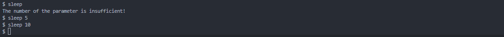

# Lab1 基本配置

## sleep

``` c
#include "kernel/types.h"
#include "kernel/stat.h"
#include "user/user.h"

int main(int argc,char *argv[]){
    if(argc < 2){
        printf("The number of the parameter is insufficient!\n");
        exit(1);
    }
    int time = atoi(argv[1]); // atoi将字符串里面的字符转换为数字
    sleep(time); 
    exit(0);
}
```




## pingpong

有两个需要注意的点

第一个是先创建管道再fork子进程，如果是先fork子进程的话，那么每一对进程都会创建两个管道；

第二个是在fork之后的if判断里面再创建管道的话，shell上不会实时出现结果，需要回车几下……

```c
#include "kernel/types.h"
#include "kernel/stat.h"
#include "user/user.h"

int buf[2] = {0};

int main(int argc,char *argv[]){
    if(argc != 1){
        printf("The number of parameter is wrong!\n");
        exit(1);
    }
    int first[2],second[2]; //两组文件描述符，用于创建两个管道
    if(pipe(first) < 0){
        printf("pingpong:pipe failed!\n");
        exit(1);
    }
    if(pipe(second) < 0){
        printf("pingpong:pipe failed!\n");
        exit(1);
    }
    int pid = fork();
    if(pid != 0){ //父进程
        int parent = getpid(); //获取父进程当前的进程id
        write(first[1],"x",1);
        read(second[0],"x",1);
        printf("%d: received pong\n",parent);
        exit(0);
    }else{ //子进程
        int child = getpid(); //获取子进程当前的进程id
        read(first[0],"x",1);
        printf("%d: received ping\n",child);
        write(second[1],"x",1);
        exit(0);
    }
}
```


## find

```c
#include "kernel/types.h"
#include "kernel/stat.h"
#include "user/user.h"
#include "kernel/fs.h"

void find(char *path,char *target){
    char buf[512], *p;
    int fd;
    struct dirent de; 
    struct stat st; 
    
    // open系统调用根据path读，返回一个文件描述符fd
    if((fd = open(path, 0)) < 0){
        fprintf(2, "find: cannot open %s\n", path);
        return;
    }

    //根据当前文件描述符fd看看是否存在，如果能正确赋值的话，按照定义就可以取出type
    if(fstat(fd, &st) < 0){ 
        fprintf(2, "find: cannot stat %s\n", path);
        close(fd);
        return;
    }

    // 判断是文件还是目录
    switch(st.type){
    //如果是文件的话就可以直接比对
    case T_FILE:
        if(strcmp(path+strlen(path)-strlen(target), target) == 0){
            printf("%s\n", path);
        }
        break;

    // 如果是目录的话
    case T_DIR:
        // 那么当前目录的长度再加一个文件的长度不能太长了（因为现在是./的形式，不能连一个文件名也放不下了）
        if(strlen(path) + 1 + DIRSIZ + 1 > sizeof buf){
            printf("find: path too long\n");
            break;
        }
        strcpy(buf, path);
        p = buf+strlen(buf);
        *p++ = '/';
        // 当前fd是目录，提取目录下的每一个内容
        while(read(fd, &de, sizeof(de)) == sizeof(de)){
            // 如果这个目录里面什么也没有，可以跳过了 
            if(de.inum == 0)
                continue;
            memmove(p, de.name, DIRSIZ);
            p[DIRSIZ] = 0;
            if(stat(buf, &st) < 0){
				printf("find: cannot stat %s\n", buf);
				continue;
			}
            // 不要进入 `.` 和 `..`
			if(strcmp(buf+strlen(buf)-2, "/.") != 0 && strcmp(buf+strlen(buf)-3, "/..") != 0) {
				find(buf, target); // 递归查找
			}
        }
        break;
    }
    close(fd);
}

int main(int argc, char *argv[]){
    if(argc <= 2){
        printf("The number of parameter is wrong!\n");
        exit(1);
    }
    char target[512]; //要寻找的目标路径
    target[0] = '/';
    strcpy(target+1, argv[2]);
	find(argv[1], target);
    exit(0);
}
```


## 