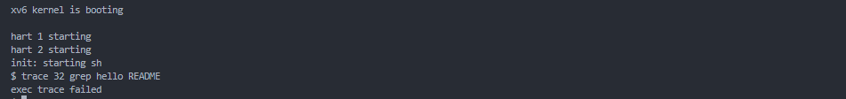
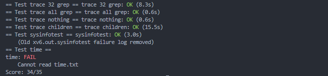

# Lab2

## 前置知识

### usys.pl

这个`usys.pl`文件是一个Perl脚本，它的作用是生成一个名为`usys.S`的汇编语言文件。为系统调用生成汇编语言入口点。

```perl
#!/usr/bin/perl -w 
#这是一个shebang行，指示系统使用Perl解释器来执行这个脚本，-w选项开启了Perl的警告模式，用于在脚本执行时显示警告信息。

# Generate usys.S, the stubs for syscalls. 首先输出如下两行注释

print "# generated by usys.pl - do not edit\n";

print "#include \"kernel/syscall.h\"\n";

sub entry {
    my $name = shift; 
    print ".global $name\n"; #全局符号声明，使其可以在其他文件中被引用
    print "${name}:\n"; #定义系统调用标签
    print " li a7, SYS_${name}\n"; #将系统调用编号加载到a7寄存器中
    print " ecall\n"; 
    print " ret\n";
}


#调用entry子程序，为每个列出的系统调用生成存根代码	
entry("fork");
entry("exit");
entry("wait");
#后续还有别的
```


## sys_trace

按照hint信息增加相关内容，通过编译后提醒trace未实现



然后阅读一波`user/trace.c`的实现

`trace 32 grep hello README`中的32是一个位图性质的参数，位图的对应位置1则代表接下来要追踪这个系统调用，置0则不用管（其中从0递增代表的是系统调用号）

```c
int
main(int argc, char *argv[])
{
  int i;
  char *nargv[MAXARG];

  if(argc < 3 || (argv[1][0] < '0' || argv[1][0] > '9')){
    fprintf(2, "Usage: %s mask command\n", argv[0]);
    exit(1);
  }

  if (trace(atoi(argv[1])) < 0) {
    fprintf(2, "%s: trace failed\n", argv[0]);
    exit(1);
  }
  
  // 比如指令`trace 32 grep hello README` 被跟踪的实际指令是grep hello README
  // 因此这里从i = 2开始读入参数
  for(i = 2; i < argc && i < MAXARG; i++){
    nargv[i-2] = argv[i];
  }
  exec(nargv[0], nargv);
  exit(0);
}
```

这些系统调用的参数是从用户态传过来的，只能从上下文中获取得到；

为了在上下文中传参，我们需要修改`proc`结构体

```c
// 一系列外部系统调用函数的声明（如 sys_chdir, sys_close, sys_dup 等）表明这些函数是操作系统提供的系统调用接口。这些函数没有参数，因为它们很可能是从某种上下文中（如用户进程的寄存器或内存中的特定位置）获取它们的参数。
extern uint64 sys_chdir(void);
extern uint64 sys_close(void);
extern uint64 sys_dup(void);

// 映射了系统调用编号到对应的系统调用函数
static uint64 (*syscalls[])(void) = {
[SYS_fork]    sys_fork,
[SYS_exit]    sys_exit,
[SYS_wait]    sys_wait,
};

// Per-process state
struct proc {
  struct spinlock lock;

  // p->lock must be held when using these:
  enum procstate state;        // Process state
  void *chan;                  // If non-zero, sleeping on chan
  int killed;                  // If non-zero, have been killed
  int xstate;                  // Exit status to be returned to parent's wait
  int pid;                     // Process ID

  // wait_lock must be held when using this:
  struct proc *parent;         // Parent process

  // these are private to the process, so p->lock need not be held.
  uint64 kstack;               // Virtual address of kernel stack
  uint64 sz;                   // Size of process memory (bytes)
  pagetable_t pagetable;       // User page table
  struct trapframe *trapframe; // data page for trampoline.S
  struct context context;      // swtch() here to run process
  struct file *ofile[NOFILE];  // Open files
  struct inode *cwd;           // Current directory
  char name[16];               // Process name (debugging)
  uint64 syscall_trace ;       // 记录哪些系统调用需要被跟踪
};

```

修改`proc`结构体之后，初始化和fork()之类的也要补上这一项，比如`allocproc`初始化进程返回给用户态时，要加上一行

```c
p->syscall_trace = 0;
```

随后实现`sys_trace`，主要就是把参数从`trapframe`中抓取过来放到`proc`结构体（也就是上下文中），供读取

```c
static uint64
argraw(int n)
{
  struct proc *p = myproc();
  switch (n) {
  case 0:
    return p->trapframe->a0;
  case 1:
    return p->trapframe->a1;
  case 2:
    return p->trapframe->a2;
  case 3:
    return p->trapframe->a3;
  case 4:
    return p->trapframe->a4;
  case 5:
    return p->trapframe->a5;
  }
  panic("argraw");
  return -1;
}

// Fetch the nth 32-bit system call argument.
int
argint(int n, int *ip)
{
  *ip = argraw(n);
  return 0;
}

uint64 sys_trace(void){
  int mask; // 跟踪的掩码

  if(argint(0,&mask) < 0)
    return -1;

  myproc()->syscall_trace = mask;
  return 0;
}
```

最后在syscall.c中增加trace的检查即可

```c
void
syscall(void)
{
  int num;
  struct proc *p = myproc();

  num = p->trapframe->a7;
  if(num > 0 && num < NELEM(syscalls) && syscalls[num]) {
    p->trapframe->a0 = syscalls[num]();
	
    // 如果有对应的系统调用的话
    // 就检查一下是否需要跟踪
    if((p->syscall_trace >> num) & 1){
      printf("%d: syscall %s -> %d\n",p->pid,syscall_names[num],p->trapframe->a0);
    }

  } else {
    printf("%d %s: unknown sys call %d\n",
            p->pid, p->name, num);
    p->trapframe->a0 = -1;
  }
}
```

## sys_info

这个taskinfo的任务和rcore差不多，看来rcore是从这里抄的（好吧，细看还是不太一样的）

```c
struct sysinfo {
  uint64 freemem;   // amount of free memory (bytes)
  uint64 nproc;     // number of process
};

// 获取系统信息
uint64 sys_sysinfo(void){
  struct sysinfo info;
  freememory(&info.freemem);
  processnumber(&info.nproc);

  uint64 dstaddr;
  argaddr(0,&dstaddr);

  if(copyout(myproc()->pagetable,dstaddr,(char*)&info,sizeof info) < 0){
    return -1;
  }
  return 0;
}

```

获取freememory的方式要参照kalloc.c这个文件

分配和回收内存空间都需要先获得死锁再释放，因此计算freememory的大小也需要死锁的保护

```c
// Allocate one 4096-byte page of physical memory.
// Returns a pointer that the kernel can use.
// Returns 0 if the memory cannot be allocated.
void *
kalloc(void)
{
  struct run *r;

  acquire(&kmem.lock);
  r = kmem.freelist;
  if(r)
    kmem.freelist = r->next;
  release(&kmem.lock);

  if(r)
    memset((char*)r, 5, PGSIZE); // fill with junk
  return (void*)r;
}

// xv6里面对于空闲内存有一个链表来维护
// 因此想知道其有多少空闲内存只需要遍历一趟freelist即可
struct run {
  struct run *next;
};

struct {
  struct spinlock lock;
  struct run *freelist;
} kmem;

// 这里参数传进一个指针，那sysinfo结构体调用的时候也传进一个指针
void freememory(uint64 *dst){
  *dst = 0;
  struct run* p = kmem.freelist;

  acquire(&kmem.lock);
  while(p){
    *dst += PGSIZE;
    p = p->next;
  }
  release(&kmem.lock);
}
```

进程数量计算

```c
// 64个进程  这是个进程表，遍历一次 只要不是UNUSED状态的进程都要计算进去
struct proc proc[NPROC]; 
enum procstate { UNUSED, USED, SLEEPING, RUNNABLE, RUNNING, ZOMBIE };

// 计算空闲内存的数量
void processnumber(uint64* dst){
  *dst = 0;
  struct proc* p;
  for(p = proc;p < &proc[NPROC];p++){
    if(p -> state != UNUSED)
      (*dst)++;
  }
}
```

这两个函数和系统调用不太一样，没用`extern`关键字的全局声明，所以需要在头文件`kernel/defs.h`中单独声明

